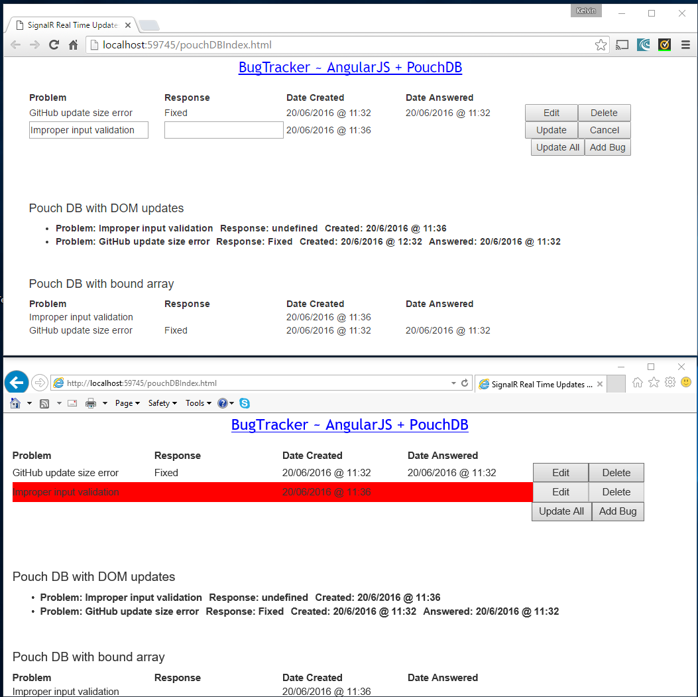

# SignalRRealTimeUpdates
Locks users out if a record is being modified using SignalR and AngularJS - Wonderful!

Added pouchDB into the equation. Start up multiple pages and once in edit mode all other users viewing the data will be locked out of updates

  

